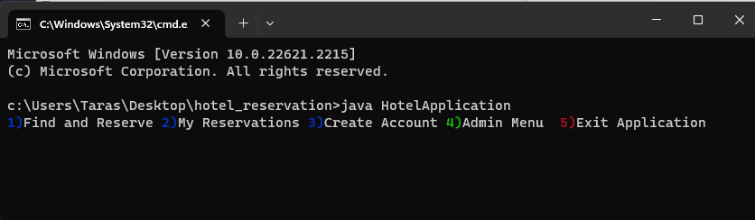
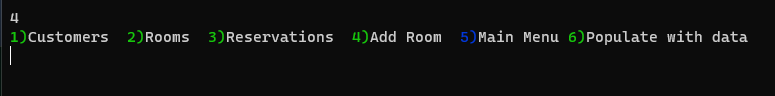

# Udacity hotel reservation app

## Description
This is an implementation of the first out of four projects in Udacity DevOps for Java Nanodegree.

This app allows customers to find and book a hotel room based on room availability. 
Following screenshots
demonstrate the functionality implemented.

Main menu:\


Admin menu:\



## How to clone this repo in terminal
```bash
git clone https://github.com/barmalini18/hotel_reservation.git hotel_reservation
```

## How to run this app in IDE
Open
```text
HotelApplication.java
```
file and run the `main()` method.

## How to run this app in terminal
1. Navigate to the source root of the project
    ```bash
    cd hotel_reservation
    ```
2. Compile the project
    ```bash
    javac HotelApplication.java
    ```
3. Run the app
    ```bash
    java HotelApplication
    ```

## TODO
### Priority
- [x] Add how run it
- [x] Add description
- [x] Add JavaDock for methods, especially public ones
- [x] Add unit tests
- [x] Clean FIXME and TODO tags
- [x] Fix IDEA’s standard linter errors
- [x] Add IDEA's plug-in to catch code style errors (Sonar) and fix errors

### Optional
- [x] Catch exceptions later in UI?
- [x] Ensure that entered check in date is earlier that check out date
- [x] Validate check-in and check-out dates in constructor of Reservation class
- [x] Fix duplicate booking
- [x] Refactor suggesting other dates
- [x] Sort elements in collections when printing them (reservations, customers)
- [x] Add option to add a room using FreeRoom class
- [x] Make classes final where applicable
- [x] Check PROJECT SPECIFICATION
- [x] Add variables' values to exception messages
- [x] When dates are printed to console, truncate time

### New features
- [x] Customize the find-a-room method to search for paid rooms or free rooms.
- [x] Provide a menu option from the Admin menu to populate the system with test data (Customers, Rooms and Reservations).
- [x] Allow the users to input how many days out the room recommendation should search if there are no available rooms.
